<div align="center">

# 🏗️ Dharohar Platform Design Document

### *Technical Architecture & Implementation Specifications*

[](https://aws.amazon.com/cdk/)
[](https://www.typescriptlang.org/)
[](https://aws.amazon.com/serverless/)

**Document Version:** 1.0 | **Last Updated:** January 2026 | **Status:** 🟢 Implementation Ready

</div>

---

## 📋 Table of Contents

1. [Overview](#overview)
2. [System Architecture](#system-architecture)
3. [Components and Interfaces](#components-and-interfaces)
4. [Data Models](#data-models)
5. [Correctness Properties](#correctness-properties)
6. [Error Handling](#error-handling)
7. [Testing Strategy](#testing-strategy)
8. [Performance Benchmarks](#performance-benchmarks)

---

## 🎯 Overview

<div align="center">

### *Serverless, Multi-Modal AI Platform for Heritage Asset Management*

</div>

Dharohar is a **serverless, multi-modal AI platform** built on AWS that transforms India's intangible cultural heritage into legally defensible digital assets. The system combines:

<table>
<tr>
<td width="50%" align="center">

### 🎤 AWS Bedrock
**Multi-Modal Processing**

Multi-language transcription and audio analysis with 95%+ accuracy in 10+ Indian dialects

</td>
<td width="50%" align="center">

### 🏛️ Amazon QLDB
**Immutable Records**

Cryptographically verifiable legal proof of "First Use"

</td>
</tr>
</table>

### 🔄 Core Workflow

```mermaid
graph LR
    A[📱 Digitize] -->|AI Processing| B[✅ Validate]
    B -->|Legal Protection| C[💰 Monetize]
    C -->|Revenue| D[👤 Creator]
    D -->|New Content| A
    
    style A fill:#2196F3,stroke:#1565C0,color:#fff
    style B fill:#4CAF50,stroke:#2E7D32,color:#fff
    style C fill:#FF9800,stroke:#E65100,color:#fff
    style D fill:#9C27B0,stroke:#6A1B9A,color:#fff
```



The platform operates on a **"Digitize → Validate → Monetize"** workflow, processing voice recordings and audio heritage through AI pipelines that generate **Digital Passports** for global licensing.

---

## 🏗️ System Architecture

### High-Level Architecture Diagram

```mermaid
graph TB
    subgraph "👥 User Layer"
        A[📱 Mobile App<br/>React Native]
        B[🌐 Web Portal<br/>React]
        C[🗣️ Voice Interface<br/>Alexa Skills]
    end
    
    subgraph "🚪 API Gateway Layer"
        D[AWS API Gateway<br/>REST + WebSocket]
        E[🔐 AWS Cognito<br/>Authentication]
    end
    
    subgraph "⚡ Processing Layer"
        F[λ Bio Processing<br/>Voice → Dossier]
        G[λ Sonic Processing<br/>Audio → Archive]
        H[λ Passport Gen<br/>QR + Metadata]
        I[λ Marketplace<br/>Licensing + Payments]
    end
    
    subgraph "🤖 AI Services"
        J[AWS Bedrock<br/>GenAI Transcription]
        K[Amazon Textract<br/>OCR Processing]
    end
    
    subgraph "💾 Data Layer"
        M[Amazon S3<br/>Media Storage]
        N[DynamoDB<br/>Metadata + Assets]
        O[QLDB<br/>Legal Records]
        P[OpenSearch<br/>Search + Analytics]
    end
    
    subgraph "🔌 External Integrations"
        Q[💳 Razorpay<br/>Payment Gateway]
        R[⛓️ Polygon<br/>Blockchain NFTs]
        S[📧 SNS<br/>Notifications]
    end
    
    A --> D
    B --> D
    C --> D
    D --> E
    D --> F
    D --> G
    D --> H
    D --> I
    F --> J
    G --> J
    H --> K
    F --> M
    G --> M
    H --> N
    I --> O
    N --> P
    I --> Q
    O --> R
    H --> S
    
    style A fill:#4CAF50,stroke:#2E7D32,color:#fff
    style B fill:#4CAF50,stroke:#2E7D32,color:#fff
    style C fill:#4CAF50,stroke:#2E7D32,color:#fff
    style D fill:#2196F3,stroke:#1565C0,color:#fff
    style E fill:#2196F3,stroke:#1565C0,color:#fff
    style F fill:#FF9800,stroke:#E65100,color:#fff
    style G fill:#FF9800,stroke:#E65100,color:#fff
    style H fill:#FF9800,stroke:#E65100,color:#fff
    style I fill:#FF9800,stroke:#E65100,color:#fff
    style J fill:#9C27B0,stroke:#6A1B9A,color:#fff
    style K fill:#9C27B0,stroke:#6A1B9A,color:#fff
    style L fill:#9C27B0,stroke:#6A1B9A,color:#fff
```



### 🎯 Microservices Architecture

The platform follows a **serverless microservices pattern** with four core services:

<table>
<tr>
<th width="20%">Service</th>
<th width="40%">Purpose</th>
<th width="40%">Key Technologies</th>
</tr>
<tr>
<td><b>🧬 Heritage-Bio</b></td>
<td>Processes oral knowledge using AWS Bedrock for transcription and botanical taxonomy mapping</td>
<td>AWS Bedrock, Knowledge Bases, Lambda, S3</td>
</tr>
<tr>
<td><b>🎵 Heritage-Sonic</b></td>
<td>Preserves audio heritage using AWS Bedrock for transcription and cultural context analysis</td>
<td>AWS Bedrock, Lambda, S3, DynamoDB</td>
</tr>
<tr>
<td><b>🏛️ Sovereignty</b></td>
<td>Manages immutable legal records on Amazon QLDB with blockchain integration</td>
<td>Amazon QLDB, Polygon, Lambda, EventBridge</td>
</tr>
<tr>
<td><b>🏪 Marketplace</b></td>
<td>Handles licensing and automated royalty distribution via smart contracts</td>
<td>DynamoDB, Razorpay, Smart Contracts, Lambda</td>
</tr>
<tr>
<td><b>🎫 Passport</b></td>
<td>Generates and manages Digital Passports with QR codes and verification</td>
<td>DynamoDB, S3, QR Generation, Lambda</td>
</tr>
</table>

### 📊 Architecture Principles

| Principle | Implementation | Benefit |
|-----------|---------------|---------|
| **🔄 Event-Driven** | EventBridge, SQS, SNS | Loose coupling, async processing, scalability |
| **⚡ Serverless-First** | Lambda, API Gateway, DynamoDB | Zero server management, auto-scaling, cost optimization |
| **🔒 Security-by-Design** | Cognito, KMS, WAF, VPC | Zero-trust, encryption everywhere, compliance |
| **📈 Observable** | CloudWatch, X-Ray, Logs Insights | Real-time monitoring, distributed tracing, debugging |
| **🌍 Multi-Region** | Global Tables, CloudFront, Route 53 | Low latency, disaster recovery, high availability |

## Components and Interfaces

### 1. Heritage-Bio Service

**Purpose**: Convert oral traditional knowledge into structured, legally defensible Prior Art Dossiers.

**Core Components**:
- **Voice Processor**: AWS Bedrock for multi-dialect transcription
- **Knowledge Mapper**: Bedrock Knowledge Bases for botanical taxonomy
- **Dossier Generator**: PDF generation with legal formatting
- **Validation Queue**: Expert review workflow

**API Endpoints**:
```typescript
POST /api/bio/upload-voice
GET /api/bio/transcription/{id}
POST /api/bio/validate-knowledge
GET /api/bio/dossier/{id}
```

**Data Flow**:
1. Voice recording → S3 storage
2. Bedrock transcription → DynamoDB metadata
3. Knowledge mapping → Botanical taxonomy
4. Expert validation → Prior Art Dossier
5. QLDB timestamping → Legal protection

### 2. Heritage-Sonic Service

**Purpose**: Preserve traditional audio heritage including folk songs, oral stories, and cultural rituals.

**Core Components**:
- **Audio Processor**: AWS Bedrock for audio transcription
- **Cultural Mapper**: Context and significance documentation
- **Archive Generator**: UNESCO-compliant archival formatting
- **Validation Queue**: Expert review workflow

**API Endpoints**:
```typescript
POST /api/sonic/upload-audio
GET /api/sonic/transcription/{id}
POST /api/sonic/validate-heritage
GET /api/sonic/archive/{id}
```

**Data Flow**:
1. Audio recording → S3 storage
2. Bedrock transcription → DynamoDB metadata
3. Cultural context → Documentation
4. Expert validation → Cultural archive
5. QLDB timestamping → Legal protection

### 3. Sovereignty Service

**Purpose**: Provide immutable legal records and blockchain integration for heritage asset protection.

**Core Components**:
- **Legal Timestamper**: Amazon QLDB integration
- **Blockchain Bridge**: Polygon network connector
- **Dispute Resolver**: Evidence generation system
- **Consent Manager**: Community permission tracking

**API Endpoints**:
```typescript
POST /api/sovereignty/timestamp-asset
GET /api/sovereignty/legal-proof/{id}
POST /api/sovereignty/blockchain-mint
GET /api/sovereignty/dispute-evidence/{id}
```

**Legal Protection Flow**:
1. Asset creation → QLDB immutable record
2. Metadata capture → GPS, timestamp, creator
3. Blockchain minting → NFT generation
4. Legal proof → Cryptographic verification
5. Dispute support → Evidence package

### 4. Marketplace Service

**Purpose**: Enable B2B licensing of heritage assets with automated royalty distribution.

**Core Components**:
- **License Manager**: Tiered access control
- **Payment Processor**: Razorpay integration
- **Smart Contracts**: Automated royalty splits
- **Analytics Engine**: Usage tracking and reporting

**API Endpoints**:
```typescript
GET /api/marketplace/browse-assets
POST /api/marketplace/purchase-license
GET /api/marketplace/my-licenses
POST /api/marketplace/royalty-distribution
```

**Licensing Workflow**:
1. Asset browsing → Metadata preview
2. License selection → Tiered pricing
3. Payment processing → Razorpay gateway
4. Smart contract → 80/20 royalty split
5. Access granting → Full asset delivery

### 5. Passport Service

**Purpose**: Generate and manage Digital Passports that serve as comprehensive asset certificates.

**Core Components**:
- **QR Generator**: Unique identifier creation
- **Metadata Aggregator**: Multi-source data compilation
- **Certificate Designer**: PDF/digital certificate creation
- **Verification Engine**: Authenticity checking system

**API Endpoints**:
```typescript
POST /api/passport/generate
GET /api/passport/verify/{qr-code}
GET /api/passport/certificate/{id}
PUT /api/passport/update-metadata
```

## Data Models

### Heritage Asset Model
```typescript
interface HeritageAsset {
  id: string;
  type: 'bio' | 'sonic';
  creator: CreatorProfile;
  metadata: AssetMetadata;
  validation: ValidationStatus;
  passport: DigitalPassport;
  licensing: LicenseInfo;
  sovereignty: SovereigntyRecord;
}

interface AssetMetadata {
  title: string;
  description: string;
  category: string;
  region: string;
  gpsCoordinates: [number, number];
  timestamp: Date;
  mediaUrls: string[];
  tags: string[];
}
```

### Digital Passport Model
```typescript
interface DigitalPassport {
  id: string;
  qrCode: string;
  assetId: string;
  authenticityScore: number;
  validationCertificate: string;
  legalTimestamp: string;
  blockchainHash: string;
  creationStory: CreationStory;
  verificationHistory: VerificationRecord[];
}

interface CreationStory {
  creatorProfile: CreatorProfile;
  processDocumentation: string[];
  traditionalContext: string;
  culturalSignificance: string;
}
```

### Creator Profile Model
```typescript
interface CreatorProfile {
  id: string;
  name: string;
  community: string;
  region: string;
  specialization: string[];
  verificationStatus: 'pending' | 'verified' | 'expert';
  walletAddress: string;
  consentRecords: ConsentRecord[];
  assets: string[];
}
```

## Correctness Properties

*A property is a characteristic or behavior that should hold true across all valid executions of a system—essentially, a formal statement about what the system should do. Properties serve as the bridge between human-readable specifications and machine-verifiable correctness guarantees.*

Let me analyze the acceptance criteria to determine which ones can be tested as properties:

<function_calls>
<invoke name="prework">
<parameter name="featureName">dharohar-craft-platform

Based on the prework analysis, I can identify several key properties that need to be validated. After reviewing for redundancy, I'll consolidate related properties:

**Property Reflection:**
- Properties 1.1 and 1.2 can be combined into a comprehensive transcription-to-taxonomy pipeline property
- Properties 2.1 and 2.2 can be combined into a video-to-authenticity-score property  
- Properties 3.1 and 3.2 can be combined into a comprehensive asset-to-QLDB property
- Properties 4.1 and 4.2 can be combined into a passport generation property

### Property 1: Transcription and Knowledge Mapping Pipeline
*For any* valid voice recording in supported dialects, the system should successfully transcribe the audio and map any mentioned plant names to their corresponding scientific taxonomy entries.
**Validates: Requirements FR-1.1.1, FR-1.1.2**

### Property 2: Prior Art Dossier Generation
*For any* successfully mapped traditional knowledge, the system should generate a Prior Art Dossier that conforms to Patent Office format requirements and includes all required legal sections.
**Validates: Requirements FR-1.1.3**

### Property 3: Legal Timestamping Consistency  
*For any* heritage asset created in the system, there should exist a corresponding immutable timestamp record in Amazon QLDB with matching asset metadata.
**Validates: Requirements FR-1.1.4, FR-3.1.1**

### Property 4: Offline-Online Synchronization
*For any* content recorded offline, when connectivity is restored, the system should successfully sync all recorded data without loss or corruption.
**Validates: Requirements FR-1.1.5**

### Property 5: Confidence-Based Routing
*For any* AI processing result with confidence score below 85%, the system should automatically route the item to the appropriate expert verifier queue.
**Validates: Requirements FR-1.2.1**

### Property 6: Video Analysis and Authenticity Scoring
*For any* uploaded craft video, the system should complete Rekognition analysis and generate a valid authenticity score between 0-100%.
**Validates: Requirements FR-2.1.1, FR-2.1.2**

### Property 7: Automatic Certification Threshold
*For any* authenticity analysis with score above 85%, the system should automatically generate a GI-tagged product certificate.
**Validates: Requirements FR-2.1.5**

### Property 8: Digital Passport Uniqueness
*For any* two validated heritage assets, their generated Digital Passports should have unique QR codes and identifiers.
**Validates: Requirements FR-2.2.1**

### Property 9: Passport Persistence
*For any* generated Digital Passport, the QR code should remain scannable and return valid asset information indefinitely.
**Validates: Requirements FR-2.2.5**

### Property 10: Payment Distribution Accuracy
*For any* license purchase transaction, the smart contract should distribute exactly 80% to the creator and 20% to the platform.
**Validates: Requirements FR-3.2.1**

### Property 11: License Content Completeness
*For any* granted license access, the delivered content should include all promised Prior Art Dossiers and creation records as specified in the license terms.
**Validates: Requirements FR-4.1.4**

### Property 12: Metadata Capture Completeness
*For any* content upload, the system should automatically capture and store GPS coordinates, timestamp, and device information in the asset metadata.
**Validates: Requirements FR-5.1.3**

### Property 13: AI Confidence Score Generation
*For any* content processed by AI services, the system should generate and store a confidence score for routing decisions.
**Validates: Requirements FR-5.2.2**

## Error Handling

### Error Categories and Strategies

**1. AI Processing Errors**
- **Transcription Failures**: Fallback to human transcription queue
- **Recognition Errors**: Route to expert verification with error context
- **Low Confidence Scores**: Automatic expert review routing
- **Model Unavailability**: Graceful degradation with retry logic

**2. Data Integrity Errors**
- **QLDB Write Failures**: Retry with exponential backoff, alert administrators
- **Blockchain Sync Issues**: Queue for later processing, maintain local records
- **Metadata Corruption**: Validate on upload, reject invalid submissions
- **File Upload Failures**: Resume capability, chunked uploads

**3. Payment and Licensing Errors**
- **Payment Gateway Failures**: Retry logic, alternative payment methods
- **Smart Contract Errors**: Manual intervention queue, transaction rollback
- **License Validation Errors**: Temporary access suspension, support notification
- **Royalty Distribution Failures**: Automatic retry, manual reconciliation

**4. User Experience Errors**
- **Network Connectivity**: Offline mode with sync queue
- **Authentication Failures**: Clear error messages, password reset flow
- **Permission Denied**: Role-based error messages, escalation paths
- **Rate Limiting**: Graceful throttling, user notification

### Error Recovery Patterns

```typescript
// Retry with exponential backoff
async function processWithRetry<T>(
  operation: () => Promise<T>,
  maxRetries: number = 3
): Promise<T> {
  for (let attempt = 1; attempt <= maxRetries; attempt++) {
    try {
      return await operation();
    } catch (error) {
      if (attempt === maxRetries) throw error;
      await delay(Math.pow(2, attempt) * 1000);
    }
  }
}

// Circuit breaker pattern for external services
class CircuitBreaker {
  private failures = 0;
  private lastFailureTime = 0;
  private state: 'CLOSED' | 'OPEN' | 'HALF_OPEN' = 'CLOSED';
  
  async execute<T>(operation: () => Promise<T>): Promise<T> {
    if (this.state === 'OPEN') {
      if (Date.now() - this.lastFailureTime > 60000) {
        this.state = 'HALF_OPEN';
      } else {
        throw new Error('Circuit breaker is OPEN');
      }
    }
    
    try {
      const result = await operation();
      this.onSuccess();
      return result;
    } catch (error) {
      this.onFailure();
      throw error;
    }
  }
}
```

## Testing Strategy

### Dual Testing Approach

The Dharohar platform requires both **unit testing** and **property-based testing** to ensure comprehensive coverage:

**Unit Tests**: Focus on specific examples, edge cases, and integration points
- API endpoint validation with known inputs
- Error handling scenarios
- Authentication and authorization flows
- Payment processing edge cases
- File upload/download functionality

**Property-Based Tests**: Verify universal properties across all inputs  
- AI processing consistency across diverse inputs
- Data integrity across all operations
- Payment distribution accuracy for all transaction amounts
- QR code uniqueness across all generated passports
- Metadata completeness for all upload types

### Property-Based Testing Configuration

**Framework**: Use **fast-check** for TypeScript/JavaScript property-based testing
- Minimum **100 iterations** per property test for statistical confidence
- Custom generators for heritage asset data, voice recordings, and craft videos
- Shrinking capability to find minimal failing examples

**Test Tagging**: Each property test must reference its design document property:
```typescript
// Example property test structure
describe('Heritage Asset Processing', () => {
  it('Property 1: Transcription and Knowledge Mapping Pipeline', 
    { tag: 'Feature: dharohar-craft-platform, Property 1: Transcription and Knowledge Mapping Pipeline' },
    () => {
      fc.assert(fc.property(
        voiceRecordingGenerator(),
        async (voiceRecording) => {
          const transcription = await transcribeAudio(voiceRecording);
          const mapping = await mapToTaxonomy(transcription);
          
          expect(transcription).toBeDefined();
          expect(mapping.scientificNames).toHaveLength(
            extractPlantNames(transcription).length
          );
        }
      ), { numRuns: 100 });
    }
  );
});
```

### Testing Infrastructure

**Test Data Generation**:
- Synthetic voice recordings in multiple dialects
- Computer-generated craft videos with known authenticity markers
- Mock botanical knowledge bases for taxonomy mapping
- Simulated payment transactions with various amounts

**Test Environment**:
- AWS LocalStack for local AWS service simulation
- Docker containers for isolated testing
- Automated CI/CD pipeline with AWS CodePipeline
- Performance testing with Artillery.js

**Coverage Requirements**:
- 90%+ code coverage for core business logic
- 100% coverage for payment and legal functions
- Property tests for all AI processing pipelines
- Integration tests for all external service interactions

### Performance Testing

**Load Testing Scenarios**:
- 1000 concurrent voice uploads during cultural festivals
- 500 simultaneous craft video analyses
- 10,000 QR code scans per minute during marketplace events
- Payment processing under high transaction volumes

**Performance Benchmarks**:
- Voice transcription: < 30 seconds for 5-minute recordings
- Video analysis: < 2 minutes for 10-minute craft videos  
- QR code generation: < 1 second per passport
- Payment processing: < 5 seconds end-to-end

---

*This design document provides the technical foundation for building Dharohar as a scalable, reliable platform that can win the AWS hackathon while delivering real impact to India's heritage communities.*