# 🏛️ Dharohar Platform Requirements Document

### *Protecting India's Traditional Medicine & Audio Heritage*

**Document Version:** 2.0 | **Last Updated:** January 2026 | **Status:** 🟢 Active Development

> **🎯 Current Scope**: This platform focuses on **Dharohar-Bio** (traditional medicine/oral knowledge) and **Dharohar-Sonic** (audio heritage/music) modules using AWS Bedrock for AI processing.

---

## 📋 Table of Contents

1. [Executive Summary](#executive-summary)
2. [Problem Statement](#problem-statement)
3. [Solution Architecture](#solution-architecture)
4. [Technical Foundation](#technical-foundation)
5. [System Glossary](#system-glossary)
6. [Functional Requirements](#functional-requirements)
7. [Non-Functional Requirements](#non-functional-requirements)
8. [Success Metrics & KPIs](#success-metrics--kpis)
9. [Hackathon MVP Scope](#hackathon-mvp-scope)
10. [Risk Mitigation](#risk-mitigation)

---

## 🎯 Executive Summary

### Vision Statement
> **Transform India's intangible cultural heritage into legally defensible, economically viable digital assets.**

### Mission
Create the world's first **"Heritage-as-an-Asset"** infrastructure that enables indigenous communities to:
- 📝 **Digitize** traditional medicine knowledge and audio heritage
- ✅ **Validate** authenticity using AI and expert verification
- 💰 **Monetize** through ethical licensing and fair revenue distribution

### Impact Goals (3-Year Horizon)

| Metric | Target | Impact |
|--------|--------|--------|
| 👥 **Heritage Creators** | 10,000+ | Communities empowered |
| 💵 **Direct Revenue** | ₹100 Crores | Economic transformation |
| 📚 **Practices Documented** | 50,000+ | Cultural preservation |
| ⚖️ **Legal Protections** | 1,000+ | Bio-piracy prevention |

---

## 🚨 Problem Statement

### *"India's cultural heritage is being lost, stolen, and undervalued"*

### 🧬 The Bio-Piracy Crisis

<table>
<tr>
<td width="50%">

**The Challenge**
- 🗣️ **80%** of tribal medicinal knowledge exists only orally
- 💊 Global pharmaceutical companies patent traditional remedies **without compensation**
- 📉 Communities lose ownership of ancestral wisdom due to **lack of documentation**

</td>
<td width="50%">

**Real-World Impact**
- **₹50,000 Crores** annual losses to Indian communities
- **Turmeric Patent Case (1995)**: US patent on wound healing - took 2 years to overturn
- **Neem Patent Case (2000)**: European patent on fungicidal properties - 10-year legal battle

</td>
</tr>
</table>

<table>
<tr>
<td width="50%">

**The Challenge**
- 🏦 Communities hold **billions** in potential IP value but have **zero liquidity**
- 🚫 No mechanism exists to license traditional knowledge to global industries
- 📊 **"Asset Rich, Cash Poor"** - the rural economy's fundamental challenge

</td>
<td width="50%">

**Market Opportunity**
- **$1.2 Trillion** global traditional medicine market (WHO, 2023)
- **₹1,000+ Crores** potential annual licensing revenue for Indian communities
- **50+ Countries** actively seeking ethical traditional knowledge partnerships

</td>
</tr>
</table>

### 🎵 The Audio Heritage Loss

<table>
<tr>
<td width="50%">

**The Challenge**
- 🎶 **90%** of traditional music and oral stories exist only in memory
- 📻 Modern media displaces traditional audio heritage
- 🎭 Folk songs, rituals, and storytelling traditions disappearing rapidly

</td>
<td width="50%">

**Real-World Impact**
- **UNESCO**: 2,500+ languages at risk of extinction
- **Oral Traditions**: 80% of indigenous music undocumented
- **Cultural Loss**: Traditional knowledge dies with elders every year

</td>
</tr>
</table>

> **💡 Key Insight**: The problem isn't lack of value—it's lack of infrastructure to capture, protect, and monetize that value.

---

## 🏗️ Solution Architecture

### **"Digitize → Validate → Monetize"** Framework

```mermaid
graph LR
    A[📱 Heritage Creator] -->|Records| B[🎤 Digitize]
    B -->|AI Processing| C[✅ Validate]
    C -->|Legal Protection| D[💰 Monetize]
    D -->|Revenue| A
    
    style A fill:#4CAF50,stroke:#2E7D32,color:#fff
    style B fill:#2196F3,stroke:#1565C0,color:#fff
    style C fill:#FF9800,stroke:#E65100,color:#fff
    style D fill:#9C27B0,stroke:#6A1B9A,color:#fff
```

### 🎯 Two Integrated Modules

<table>
<tr>
<th width="50%">🧬 Dharohar-Bio</th>
<th width="50%">🎵 Dharohar-Sonic</th>
</tr>
<tr>
<td>

**Oral Knowledge → Prior Art Dossiers**

- Voice recording in native dialects
- AWS Bedrock AI transcription & analysis
- Botanical taxonomy mapping
- Patent Office-compliant documentation
- Traditional medicine preservation

</td>
<td>

**Audio Heritage → Digital Archives**

- Traditional music & storytelling recording
- AWS Bedrock audio transcription & analysis
- Cultural context documentation
- UNESCO-compliant archival
- Folk song and ritual preservation

</td>
</tr>
<tr>
<td colspan="2" align="center">

**🏛️ Sovereignty Vault** (Shared Infrastructure)

Amazon QLDB immutable records • Blockchain timestamping • Smart contract royalty distribution • B2B licensing marketplace

</td>
</tr>
</table>

### 🔄 End-to-End Workflow

```mermaid
sequenceDiagram
    participant Creator as 👤 Heritage Creator
    participant Mobile as 📱 Mobile App
    participant AI as 🤖 AWS Bedrock
    participant Vault as 🏛️ Sovereignty Vault
    participant Market as 🏪 Marketplace
    participant Buyer as 💼 License Buyer
    
    Creator->>Mobile: Record voice/audio
    Mobile->>AI: Upload for processing
    AI->>AI: Transcribe & Analyze
    AI->>Vault: Create immutable record
    Vault->>Mobile: Generate Digital Passport
    Mobile->>Creator: QR code certificate
    
    Buyer->>Market: Browse heritage assets
    Market->>Buyer: Show authenticated content
    Buyer->>Market: Purchase license
    Market->>Creator: 80% royalty payment
    Market->>Vault: Record transaction
```

---

## 🛠️ Technical Foundation

### AWS Services Stack

<table>
<tr>
<th>Category</th>
<th>Service</th>
<th>Purpose</th>
<th>Why This Choice</th>
</tr>
<tr>
<td rowspan="2">🤖 <b>AI/ML</b></td>
<td><b>AWS Bedrock</b></td>
<td>Multi-dialect transcription & audio analysis</td>
<td>Foundation models for 100+ languages, audio processing, fine-tuning capability</td>
</tr>
<tr>
<td><b>Amazon Textract</b></td>
<td>Document processing</td>
<td>Extract text from historical documents and certificates</td>
</tr>
<tr>
<td rowspan="4">💾 <b>Data</b></td>
<td><b>Amazon S3</b></td>
<td>Media storage</td>
<td>99.999999999% durability, lifecycle policies, versioning</td>
</tr>
<tr>
<td><b>DynamoDB</b></td>
<td>NoSQL database</td>
<td>Single-digit millisecond latency, auto-scaling, global tables</td>
</tr>
<tr>
<td><b>Amazon QLDB</b></td>
<td>Immutable ledger</td>
<td>Cryptographically verifiable, SQL-like queries, audit trail</td>
</tr>
<tr>
<td><b>OpenSearch</b></td>
<td>Search & analytics</td>
<td>Full-text search, faceted navigation, real-time indexing</td>
</tr>
<tr>
<td rowspan="2">⚡ <b>Compute</b></td>
<td><b>AWS Lambda</b></td>
<td>Serverless functions</td>
<td>Pay-per-use, auto-scaling, 15-minute max execution</td>
</tr>
<tr>
<td><b>API Gateway</b></td>
<td>REST API management</td>
<td>Throttling, caching, API versioning, CORS support</td>
</tr>
<tr>
<td rowspan="3">🔒 <b>Security</b></td>
<td><b>AWS Cognito</b></td>
<td>Authentication</td>
<td>User pools, MFA, social login, custom attributes</td>
</tr>
<tr>
<td><b>AWS KMS</b></td>
<td>Encryption</td>
<td>FIPS 140-2 validated, automatic key rotation</td>
</tr>
<tr>
<td><b>AWS WAF</b></td>
<td>Web firewall</td>
<td>DDoS protection, bot mitigation, rate limiting</td>
</tr>
<tr>
<td rowspan="2">📱 <b>Frontend</b></td>
<td><b>React Native</b></td>
<td>Mobile app</td>
<td>Cross-platform, native performance, large ecosystem</td>
</tr>
<tr>
<td><b>AWS Amplify</b></td>
<td>Frontend framework</td>
<td>Authentication, API, storage integration out-of-the-box</td>
</tr>
</table>

### 🎯 Core Capabilities

<table>
<tr>
<td width="50%">

#### 🎙️ Multi-Modal AI Processing
- **Voice**: 95%+ accuracy in 10+ Indian dialects
- **Audio**: Music and storytelling analysis
- **Text**: OCR for historical documents
- **Transcription**: Real-time and batch processing

</td>
<td width="50%">

#### 🔗 Blockchain Integration
- **QLDB**: Immutable timestamping with cryptographic proof
- **Polygon**: NFT minting for digital ownership
- **Smart Contracts**: Automated royalty distribution
- **Interoperability**: Cross-chain asset portability

</td>
</tr>
<tr>
<td width="50%">

#### 📡 Offline-First Architecture
- **Local Storage**: IndexedDB for mobile, SQLite for native
- **Sync Queue**: Automatic upload when connectivity returns
- **Conflict Resolution**: Last-write-wins with version tracking
- **Progressive Enhancement**: Core features work offline

</td>
<td width="50%">

#### 🗣️ Voice-First UX
- **Zero Literacy Barriers**: Voice commands for all actions
- **Dialect Support**: Gondi, Bhili, Malwi, Hindi, English
- **Audio Feedback**: Spoken confirmations and guidance
- **Accessibility**: WCAG 2.1 AA compliant

</td>
</tr>
</table>

### 📊 Architecture Principles

| Principle | Implementation | Benefit |
|-----------|---------------|---------|
| **Serverless-First** | Lambda, API Gateway, DynamoDB | Zero server management, auto-scaling, pay-per-use |
| **AI-Native** | Bedrock, Rekognition, Textract | State-of-the-art accuracy, continuous improvement |
| **Security-by-Design** | Encryption, MFA, RBAC, audit logs | GDPR compliant, zero-trust architecture |
| **Mobile-First** | React Native, offline support | 80%+ users on mobile, poor connectivity areas |
| **API-Driven** | REST APIs, GraphQL subscriptions | Extensibility, third-party integrations |

---

## 📖 System Glossary

<table>
<tr>
<th width="25%">Term</th>
<th width="75%">Definition</th>
</tr>
<tr>
<td><b>Digital_Passport</b> 🎫</td>
<td>Immutable certificate combining authenticity validation, GPS coordinates, creation documentation, and QR code for instant verification. Acts as a "birth certificate" for heritage assets.</td>
</tr>
<tr>
<td><b>Prior_Art_Dossier</b> 📄</td>
<td>Legal documentation of traditional knowledge formatted for patent office submission. Includes botanical taxonomy, usage methods, historical evidence, and community consent.</td>
</tr>
<tr>
<td><b>Sovereignty_Vault</b> 🏛️</td>
<td>Amazon QLDB-based immutable ledger providing cryptographic proof of "First Use" for legal disputes. Timestamped records cannot be altered or deleted.</td>
</tr>
<tr>
<td><b>Dharohar_Bio</b> 🧬</td>
<td>Voice-first AI agent recording oral remedies in native dialects and mapping local plant names to scientific taxonomy using AWS Bedrock Knowledge Bases.</td>
</tr>
<tr>
<td><b>Dharohar_Sonic</b> 🎵</td>
<td>Audio heritage preservation system recording traditional music, folk songs, and oral storytelling using AWS Bedrock for transcription and cultural context analysis.</td>
</tr>
<tr>
<td><b>License_Marketplace</b> 🏪</td>
<td>B2B portal enabling ethical licensing of heritage assets with tiered access (research, commercial, exclusive) and automated smart contract royalty distribution (80% creator, 20% platform).</td>
</tr>
<tr>
<td><b>Heritage_Creator</b> 👤</td>
<td>Traditional knowledge holder including healers, weavers, storytellers, artisans, and community elders. Primary beneficiaries of the platform.</td>
</tr>
<tr>
<td><b>Expert_Verifier</b> 👨‍🔬</td>
<td>Domain specialist (botanist, textile expert, anthropologist) validating AI assessments when confidence score <85%. Provides feedback for model improvement.</td>
</tr>
<tr>
<td><b>License_Buyer</b> 💼</td>
<td>Researcher, pharmaceutical company, fashion brand, or institution purchasing ethical access to heritage assets for research, commercial use, or exclusive rights.</td>
</tr>
</table>

---

## 📋 Functional Requirements

### *Detailed specifications for each platform module*

## 🧬 Module 1: Dharohar-Bio (Oral Knowledge Protection)

### FR-1.1: Voice-First Knowledge Capture
**User Story:** As a tribal healer, I want to document my traditional remedies in my native dialect, so that my knowledge is preserved and legally protected from bio-piracy.

**Business Value:** Prevents ₹50,000 crores annual bio-piracy losses to Indian communities.

#### Acceptance Criteria
1. **Multi-Dialect Support**: WHEN a healer speaks in Gondi/Bhili/Malwi dialects, THE Dharohar_Bio SHALL transcribe using AWS Bedrock with 95%+ accuracy
2. **Botanical Mapping**: WHEN transcription completes, THE System SHALL map local plant names to scientific taxonomy using Bedrock Knowledge Bases
3. **Prior Art Generation**: WHEN mapping succeeds, THE System SHALL auto-generate Prior_Art_Dossiers compliant with Patent Office formats
4. **Legal Timestamping**: WHEN dossier is created, THE Sovereignty_Vault SHALL record immutable timestamp on Amazon QLDB
5. **Offline Capability**: THE System SHALL support offline voice recording with automatic sync when connectivity returns

### FR-1.2: Traditional Knowledge Validation
**User Story:** As a botanist verifier, I want to validate traditional remedy claims, so that documented knowledge meets scientific standards.

#### Acceptance Criteria
1. **Expert Review Queue**: WHEN AI confidence < 85%, THE System SHALL route to domain expert verifiers
2. **Scientific Cross-Reference**: WHEN reviewing, THE System SHALL display existing research on claimed medicinal properties
3. **Validation Workflow**: WHEN expert approves, THE System SHALL mint verified Digital_Passport
4. **Feedback Loop**: WHEN expert rejects, THE System SHALL provide specific improvement guidance
5. **Accuracy Tracking**: THE System SHALL monitor verifier accuracy and adjust AI thresholds accordingly

## 🎵 Module 2: Dharohar-Sonic (Audio Heritage Preservation)

### FR-2.1: Audio Heritage Capture
**User Story:** As a traditional musician, I want to record and preserve my folk songs and oral stories, so that my cultural heritage is documented for future generations.

**Business Value:** Preserves 90% of undocumented traditional music and oral traditions before they disappear.

#### Acceptance Criteria
1. **Audio Recording**: WHEN a creator records audio, THE Dharohar_Sonic SHALL capture high-quality audio with metadata
2. **Transcription**: WHEN audio uploads, THE System SHALL transcribe using AWS Bedrock with 95%+ accuracy
3. **Cultural Context**: WHEN transcription completes, THE System SHALL prompt for cultural significance and historical context
4. **UNESCO Compliance**: WHEN documentation is complete, THE System SHALL format records according to UNESCO archival standards
5. **Offline Capability**: THE System SHALL support offline audio recording with automatic sync when connectivity returns

### FR-2.2: Digital Passport Creation
**User Story:** As a cultural researcher, I want to verify the authenticity and origin of traditional audio heritage, so that I can confidently use it for research and preservation.

#### Acceptance Criteria
1. **Unique Identification**: WHEN audio passes validation, THE System SHALL create unique Digital_Passport with QR code
2. **Creation Documentation**: WHEN passport generates, THE System SHALL link to creator profile, GPS coordinates, timestamp, cultural context
3. **Researcher Verification**: WHEN QR scanned, THE System SHALL display creator profile, audio samples, cultural significance
4. **Immutable Record**: WHEN displaying info, THE System SHALL show cryptographically verified authenticity data
5. **Lifetime Validity**: THE Digital_Passport SHALL remain scannable and verifiable permanently

## 🏛️ Module 3: Sovereignty Vault (Legal Protection)

### FR-3.1: Immutable Legal Records
**User Story:** As a community leader, I want cryptographic proof of our traditional knowledge ownership, so that we can prevent bio-piracy and establish legal claims.

**Business Value:** Provides legal standing in international IP disputes worth billions.

#### Acceptance Criteria
1. **Blockchain Timestamping**: WHEN any heritage asset uploads, THE Sovereignty_Vault SHALL create immutable QLDB record
2. **Comprehensive Metadata**: WHEN recording, THE System SHALL capture GPS coordinates, timestamp, creator identity, asset hash
3. **Legal Proof**: WHEN disputes arise, THE System SHALL provide cryptographically verifiable "First Use" evidence
4. **Bio-Piracy Detection**: WHEN patent applications filed, THE System SHALL auto-flag potential traditional knowledge conflicts
5. **Community Consent**: THE Sovereignty_Vault SHALL enforce community consent requirements for all external access

### FR-3.2: Smart Contract Automation
**User Story:** As a heritage creator, I want automatic royalty distribution, so that I receive fair compensation without manual intervention.

#### Acceptance Criteria
1. **Automated Splits**: WHEN license purchased, THE System SHALL execute smart contracts distributing 80% to creator, 20% to platform
2. **Multi-Payment Support**: WHEN processing payments, THE System SHALL accept UPI, digital wallets, cryptocurrency
3. **Instant Settlement**: WHEN transaction completes, THE System SHALL provide immediate payment confirmation to all parties
4. **Transparent Records**: WHEN payments process, THE System SHALL maintain auditable transaction history
5. **Community Wallets**: THE System SHALL support collective community wallets for shared traditional knowledge

## 🏪 Module 4: License Marketplace (B2B Portal)

### FR-4.1: Research License Platform
**User Story:** As a pharmaceutical researcher, I want to ethically purchase traditional knowledge access, so that I can conduct research while compensating original knowledge holders.

**Business Value:** Creates new ₹1000+ crores annual revenue stream for rural communities.

#### Acceptance Criteria
1. **Searchable Catalog**: WHEN researchers browse, THE License_Marketplace SHALL display heritage assets with metadata previews
2. **Tiered Access**: WHEN purchasing, THE System SHALL offer different license tiers (research, commercial, exclusive)
3. **Ethical Compliance**: WHEN licensing, THE System SHALL ensure Nagoya Protocol and ABS compliance
4. **Full Documentation**: WHEN access granted, THE System SHALL provide complete Prior_Art_Dossiers and creation records
5. **Usage Tracking**: THE System SHALL monitor license usage and enforce terms automatically

### FR-4.2: Cultural Partnership Portal
**User Story:** As a cultural institution, I want to source authentic traditional audio heritage, so that I can create ethical archives while supporting indigenous communities.

#### Acceptance Criteria
1. **Institution Verification**: WHEN institutions register, THE System SHALL verify credentials and ethical standards
2. **Bulk Licensing**: WHEN institutions purchase, THE System SHALL support bulk licensing with volume discounts
3. **Attribution Requirements**: WHEN using content, THE System SHALL enforce proper attribution and origin labeling
4. **Impact Reporting**: WHEN partnerships active, THE System SHALL provide community impact metrics to institutions
5. **Sustainability Tracking**: THE System SHALL monitor and report cultural and social impact of partnerships

## 🔧 Module 5: Platform Infrastructure

### FR-5.1: User Onboarding & Accessibility
**User Story:** As a tribal elder with limited digital literacy, I want simple registration and content sharing, so that I can participate without technical barriers.

#### Acceptance Criteria
1. **Voice-First Registration**: WHEN users register, THE System SHALL create profiles using voice commands in local dialects
2. **Visual Guidance**: WHEN recording content, THE System SHALL provide clear visual/audio guides for quality
3. **Auto-Metadata**: WHEN uploading, THE System SHALL automatically capture GPS, timestamp, device info
4. **Digital Wallet Setup**: WHEN profile completes, THE System SHALL create secure wallet for royalty payments
5. **Offline Support**: THE System SHALL function offline with sync when connectivity available

### FR-5.2: AI Model Management
**User Story:** As a platform operator, I want continuously improving AI accuracy, so that validation quality increases over time.

#### Acceptance Criteria
1. **Multi-Modal Processing**: WHEN content uploads, THE System SHALL route voice to Bedrock, video to Rekognition appropriately
2. **Confidence Scoring**: WHEN AI processes content, THE System SHALL generate confidence scores for human review routing
3. **Model Training**: WHEN expert verifications occur, THE System SHALL use feedback to retrain custom models
4. **Performance Monitoring**: WHEN models run, THE System SHALL track accuracy, latency, and cost metrics
5. **Automated Scaling**: THE System SHALL auto-scale compute resources based on processing demand

# Non-Functional Requirements

## Performance Requirements
- **Response Time**: AI processing < 30 seconds for voice, < 2 minutes for video
- **Throughput**: Support 1000+ concurrent users, 10,000+ daily uploads
- **Availability**: 99.9% uptime with automatic failover
- **Scalability**: Auto-scale to handle 10x traffic spikes during cultural events

## Security Requirements
- **Data Encryption**: AES-256 encryption at rest, TLS 1.3 in transit
- **Access Control**: Multi-factor authentication, role-based permissions
- **Privacy**: GDPR compliance, community data sovereignty
- **Audit Trail**: Immutable logs of all access and modifications

## Compliance Requirements
- **Legal**: Nagoya Protocol, Biological Diversity Act 2002, TRIPS Agreement
- **Cultural**: UNESCO Intangible Cultural Heritage guidelines
- **Technical**: AWS Well-Architected Framework, ISO 27001
- **Financial**: RBI guidelines for digital payments, cryptocurrency regulations

## Usability Requirements
- **Accessibility**: WCAG 2.1 AA compliance, voice-first interface
- **Localization**: Support for 10+ Indian languages and dialects
- **Offline**: Core functions work without internet connectivity
- **Mobile-First**: Optimized for smartphones with limited data plans

# Success Metrics & KPIs

## Impact Metrics (3-Year Goals)
- **Community Reach**: 10,000+ heritage creators onboarded
- **Economic Impact**: ₹100 crores direct revenue to communities
- **Knowledge Preservation**: 50,000+ traditional practices documented
- **Legal Protection**: 1,000+ prior art dossiers filed, 100+ bio-piracy cases prevented

## Platform Metrics
- **User Engagement**: 80%+ monthly active users, 60+ minutes average session
- **Content Quality**: 95%+ AI accuracy, 90%+ expert approval rate
- **Transaction Volume**: ₹10 crores annual marketplace transactions
- **Global Reach**: 50+ countries accessing licensed content

## Technical Metrics
- **Performance**: <2s page load, 99.9% API uptime
- **Accuracy**: 95%+ voice transcription, 90%+ authenticity detection
- **Cost Efficiency**: <₹10 per asset processed
- **Security**: Zero data breaches, 100% compliance audits passed

# Hackathon MVP Scope

## Phase 1: Core Demo (48 Hours)
**Priority Features for Judging:**
1. **Dharohar-Bio**: Voice recording → AWS Bedrock transcription → Prior Art PDF
2. **Dharohar-Sonic**: Audio recording → AWS Bedrock transcription → Cultural archive
3. **Digital Passport**: QR code generation with basic asset information
4. **Simple UI**: React Native app with voice commands and audio recording

**Demo Flow:**
1. Record traditional remedy in Hindi/English (Bio module)
2. Record folk song or oral story (Sonic module)
3. Generate Digital Passport with QR code
4. Show marketplace preview with licensing options

## Phase 2: Enhanced Features (Post-Hackathon)
- Multi-dialect support (Gondi, Bhili)
- Amazon QLDB integration
- Smart contract automation
- Expert verification workflow
- Advanced audio analysis models

# Risk Mitigation

## Technical Risks
- **AI Accuracy**: Start with high-confidence use cases, expand gradually
- **Connectivity**: Offline-first architecture with sync capabilities
- **Scalability**: Serverless architecture with auto-scaling

## Business Risks  
- **User Adoption**: Partner with NGOs and government programs
- **Content Quality**: Implement robust verification workflows
- **Legal Challenges**: Work with IP lawyers and cultural experts

## Cultural Risks
- **Community Trust**: Transparent governance, community ownership
- **Cultural Sensitivity**: Local advisory boards, consent protocols
- **Knowledge Exploitation**: Strong legal protections, fair revenue sharing

---

**Document Version:** 1.0  
**Last Updated:** January 2026  
**Next Review:** Post-Hackathon Implementation Planning